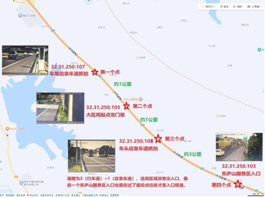
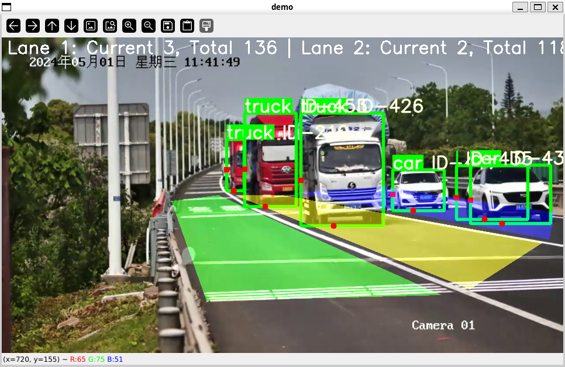
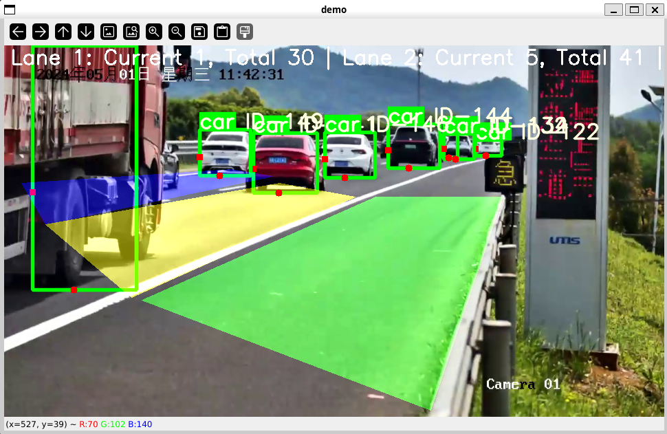
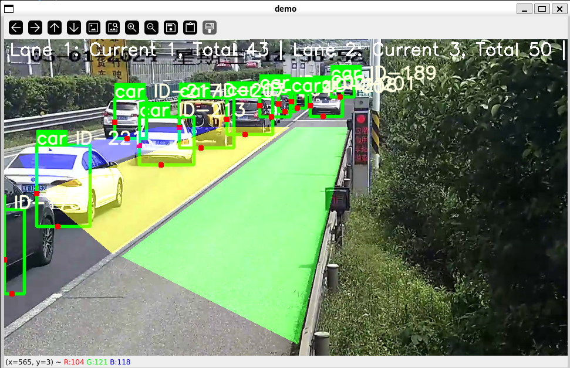
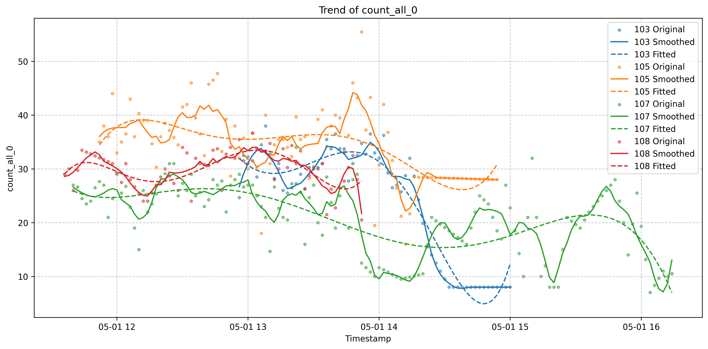
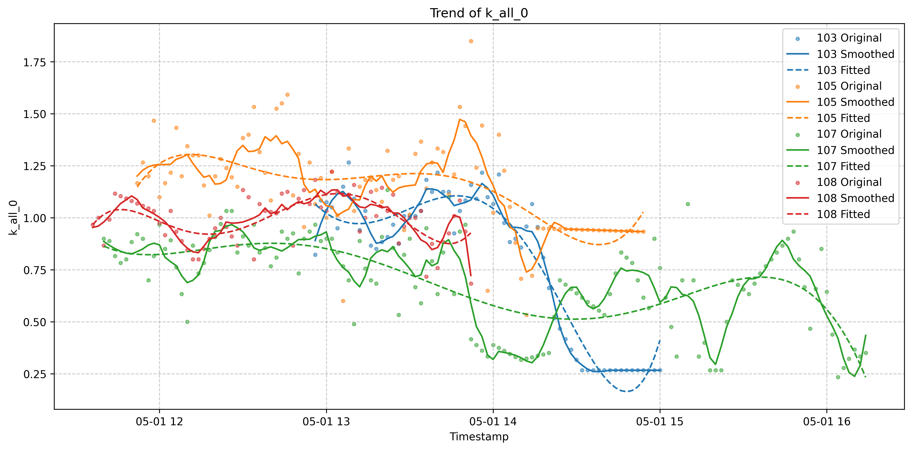
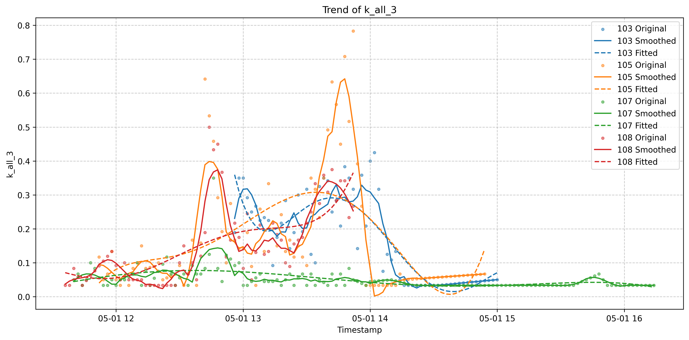
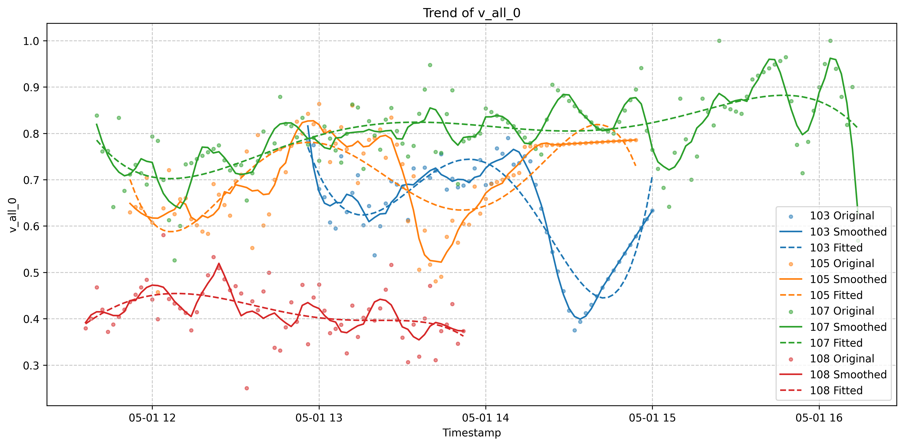

# Description

Emergency Enabling of Highway Emergency Lanes Based on High Precision Simulation and Deep Learning. This project is for the 2024 Graduate Student Mathematical Modeling Competition E Question. This project is inspired by and references the work done in [win10_yolov5_deepsort_counting](https://github.com/dyh/win10_yolov5_deepsort_counting).

<!-- PROJECT SHIELDS -->

<!-- [![Contributors][contributors-shield]][contributors-url]
[![Forks][forks-shield]][forks-url]
[![Stargazers][stars-shield]][stars-url]
[![Issues][issues-shield]][issues-url]
[![MIT License][license-shield]][license-url]
[![LinkedIn][linkedin-shield]][linkedin-url] -->


<!-- PROJECT LOGO -->
<br />

<p align="center">
  <a href="https://github.com/haowei2000/RBLU/">
    
  </a>

  <h3 align="center">The simple schema</h3>
  <p align="left">
    There are four video observation points on a road section (length about 5000m, travel lane 2 + emergency lane 1)
    <br />
    <a href="https://github.com/haowei2000/RBLU"><strong>Explore the doc »</strong></a>
    <br />
    <br />
    <a href="https://github.com/haowei2000/RBLU">View Demo</a>
    ·
    <a href="https://github.com/haowei2000/RBLU/issues">Report Bug</a>
    ·
    <a href="https://github.com/haowei2000/RBLU/issues">Request Feature</a>
  </p>

</p>
Solving Problem: How to Construct a Highway Traffic Congestion Model
There are four video observation points (see Schematic 1) on a certain road section (length about 5000m, travel lane 2 + emergency lane 1):
(1) For the data provided in the question, count the change rule of traffic flow parameters over time at the four observation points (finer statistics can be more conducive to future modeling);
(2) the establishment of traffic flow congestion model, using the traffic flow in the four observation points of the basic parameters (traffic density, flow, speed, etc.) and the road situation (two lanes), give from the third point to the fourth blockage before the point between the road section may (no congestion) appear sustained (for example, the duration of half an hour) the state of the real-time warning of the congestion (for example, congestion 10 minutes before the warning) and the basis;
 
## Content

- [Built With](#Built-With)
- [About The Project](#About-The-Project)
  - [Dependencies](#Dependencies)
  - [Installation](#Installation)
- [Project Tree](#Project-Tree)
- [Usage](#Usage)
- [Roadmap](#Roadmap)
- [Author](#Author)
- [Acknowledgments](#Acknowledgments)


## Built With
* [![Python][Python]][Python-url]
* [![scikit-learn][scikit-learn]][scikit-learn-url]
* [![AutoGluon][AutoGluon]][AutoGluon-url]

[Python]: https://img.shields.io/badge/Python-3776AB?style=flat-square&logo=Python&logoColor=white
[Python-url]: https://www.python.org/
[scikit-learn]: https://img.shields.io/badge/scikit--learn-F7931E?style=flat-square&logo=scikit-learn&logoColor=white
[scikit-learn-url]: https://scikit-learn.org/
[AutoGluon]: https://img.shields.io/badge/AutoGluon-00C7B7?style=flat-square&logo=AutoGluon&logoColor=white
[AutoGluon-url]: https://auto.gluon.ai/


## Getting Start


### Dependencies
- `python` = "^3.8"
- `matplotlib` = ">=3.2.2"
- `numpy` = ">=1.18.5"
- `opencv-python` = ">=4.1.2"
- `Pillow` = ">=7.1.2"
- `PyYAML` = ">=5.3.1"
- `requests` = ">=2.23.0"
- `scipy` = ">=1.4.1"
- `torch` = ">=1.7.0"
- `torchvision` = ">=0.8.1"
- `tqdm` = ">=4.41.0"
- `tensorboard` = ">=2.4.1"
- `pandas` = ">=1.1.4"
- `seaborn` = ">=0.11.0"
- `thop` = "*"
- `easydict` = "*"

### **Installation**

1. install [poetry](https://python-poetry.org/)
2. Clone the repo
3. Installing dependencies with poetry
```sh
poetry install
```

## Project Tree
eg:

```
sxjm2024
├── notebook
├── figure
│   ├── raw
├── res
│   ├── configs
├── src
│   ├── models
│   ├── results
│   ├── traffic
│   │   ├── chart
│   │   ├── detect
│   │   ├── predict
│   │   ├── analysis
├── tests
├── .gitignore
├── README.md
├── pyproject.toml
└── LICENSE.txt
```

## Usage
Before running the project, ensure that the current working directory is set to the `project` directory. And then you can get the video detection result by the following command:
```sh
poetry run detect
```
Next you can draw the result by
```sh
poetry run draw
```
Or you can re-calculate the congestion information by:
```sh
poetry run calculate
```
Lastly, you can view the prediction results from time series models by:
```sh
poetry run predict
```

## Roadmap
__Step1__: YOLOV5+DeepSort recognizes vehicles, refer to this project, in which we modified its recognition range and added separate recognition statistics for different lanes (including emergency lanes).

<p align="center">
  <table>
    <tr>
      <td align="center">
        
        <br>
        <em>Subplot 1: 107 port</em>
      </td>
      <td align="center">
        
        <br>
        <em>Subplot 2: 105 port</em>
      </td>
    </tr>
    <tr>
      <td align="center">
        
        <br>
        <em>Subplot 3: 108 port</em>
      </td>
      <td align="center">
        
        <br>
        <em>Subplot 4: 103 port</em>
      </td>
    </tr>
  </table>
</p>

__Step2__: Calculate the traffic information, you can see all the features in [traffic_info.md](notebook/traffic_info.md) and all the results in [result-folder](src/results) `line_page.png` abd `hist_page.png`.
The following is some main results:
<p align="center">
  <table>
    <tr>
      <td align="center">
        
        <br>
        <em>Number of all vehicles at all times</em>
      </td>
      <td align="center">
        
        <br>
        <em>Densities of all vehicles </em>
      </td>
    </tr>
    <tr>
      <td align="center">
        
        <br>
        <em>Densities of all vehicles in the emergency lane</em>
      </td>
      <td align="center">
        
        <br>
        <em>Speed of all vehicles</em>
      </td>
    </tr>
  </table>
</p>

__Step3__: Predict the congestion with 2 mode: Self-mode and Global-mode. 

The `self-mode` means that the detection point predicts the traffic congestion in the next ten minutes based only on the road traffic data of the past period of time at that point (ignoring the data of other detection points). In this model: to predict the congestion at site 103 for the next 10 minutes, the time series model only accepts data from the 103 detection points, where the degree of traffic congestion is used as the target variable, and the covariates are the road condition data (including the flow, density, and speed of the main lanes, the overtaking lanes, and the emergency lanes, as well as the number of cars, trucks, buses, etc., on the road)

The `global-mode` means that the simultaneous reference to the traffic road data of the four detection sites in the past period of time to predict the traffic congestion in the next ten minutes. For example, to predict the next 10 minutes of congestion at station 103 target variable, the time series model simultaneously accepts the road condition data of the four monitoring points as covariates, and at the same time introduces the poi values of the four stations as static variables for the training of the time series model
### Some insights

| Mode   | Model                        | MASE  | RMSE  | MAPE  | SMAPE | MAE   | RMSSE | WAPE  | WQL   | SQL   |
|--------|---------------------------|-------|-------|-------|-------|-------|-------|-------|-------|-------|
| Self | SeasonalNaive             | 0.056 | 0.066 | 0.398 | 0.315 | 0.056 | 0.066 | 0.338 | 0.301 | 0.050 |
|        | RecursiveTabular          | 0.076 | 0.091 | 0.538 | 0.660 | 0.076 | 0.091 | 0.456 | 0.347 | 0.057 |
|        | DirectTabular             | 0.051 | 0.059 | 0.476 | 0.332 | 0.051 | 0.059 | 0.310 | 0.258 | 0.043 |
|        | CrostonSBA                | 0.040 | 0.048 | 0.366 | 0.273 | 0.040 | 0.048 | 0.242 | 0.181 | 0.030 |
|        | NPTS                      | 0.059 | 0.073 | 0.598 | 0.360 | 0.059 | 0.073 | 0.357 | 0.343 | 0.057 |
|        | DynamicOptimizedTheta     | 0.045 | 0.055 | 0.350 | 0.273 | 0.045 | 0.055 | 0.269 | 0.212 | 0.035 |
|        | AutoETS                   | 0.047 | 0.057 | 0.365 | 0.285 | 0.047 | 0.057 | 0.283 | 0.225 | 0.037 |
|        | AutoARIMA                 | 0.045 | 0.055 | 0.391 | 0.289 | 0.045 | 0.055 | 0.273 | 0.240 | 0.040 |
|        | Chronos[base]             | 0.047 | 0.057 | 0.431 | 0.308 | 0.047 | 0.057 | 0.286 | 0.240 | 0.040 |
|        | TemporalFusionTransformer | 0.056 | 0.065 | 0.481 | 0.343 | 0.056 | 0.065 | 0.338 | 0.281 | 0.046 |
|        | DeepAR                    | 0.064 | 0.074 | 0.510 | 0.367 | 0.064 | 0.074 | 0.386 | 0.323 | 0.053 |
|        | PatchTST                  | 0.035 | 0.044 | 0.341 | 0.248 | 0.035 | 0.044 | 0.209 | 0.172 | 0.029 |
|        | WeightedEnsemble          | 0.037 | 0.046 | 0.341 | 0.248 | 0.037 | 0.046 | 0.223 | 0.189 | 0.031 |
| Global  | SeasonalNaive             | 0.010 | 0.010 | 0.182 | 0.167 | 0.010 | 0.010 | 0.182 | 0.645 | 0.037 |
|        | RecursiveTabular          | 0.171 | 0.171 | 2.994 | 1.199 | 0.171 | 0.171 | 2.994 | 2.045 | 0.117 |
|        | DirectTabular             | 0.119 | 0.119 | 2.087 | 1.021 | 0.119 | 0.119 | 2.087 | 1.819 | 0.104 |
|        | CrostonSBA                | 0.033 | 0.033 | 0.576 | 0.447 | 0.033 | 0.033 | 0.576 | 0.402 | 0.023 |
|        | NPTS                      | 0.143 | 0.143 | 2.500 | 1.111 | 0.143 | 0.143 | 2.500 | 2.345 | 0.134 |
|        | DynamicOptimizedTheta     | 0.002 | 0.002 | 0.037 | 0.036 | 0.002 | 0.002 | 0.037 | 0.296 | 0.017 |
|        | AutoETS                   | 0.010 | 0.010 | 0.183 | 0.168 | 0.010 | 0.010 | 0.183 | 0.147 | 0.008 |
|        | AutoARIMA                 | 0.011 | 0.011 | 0.186 | 0.170 | 0.011 | 0.011 | 0.186 | 0.276 | 0.016 |
|        | Chronos[base]             | 0.127 | 0.127 | 2.228 | 1.054 | 0.127 | 0.127 | 2.228 | 2.098 | 0.120 |
|        | TemporalFusionTransformer | 0.157 | 0.157 | 2.747 | 1.157 | 0.157 | 0.157 | 2.747 | 2.590 | 0.148 |
|        | DeepAR                    | 0.183 | 0.183 | 3.202 | 1.231 | 0.183 | 0.183 | 3.202 | 3.111 | 0.178 |
|        | PatchTST                  | 0.129 | 0.129 | 2.263 | 1.062 | 0.129 | 0.129 | 2.263 | 2.202 | 0.126 |
|        | WeightedEnsemble          | 0.172 | 0.172 | 3.007 | 1.201 | 0.172 | 0.172 | 3.007 | 2.810 | 0.161 |


## Author

[Haowei Wang](mailto:wanghw00@gmail.com)

[AlexLiu](https://github.com/MAXIMUM950814)

## License
This project is licensed under the MIT License. For more details, please refer to [LICENSE.txt](https://github.com/haowei2000/RBLU/blob/master/LICENSE.txt)

## Acknowledgments

- [GitHub Pages](https://pages.github.com)
- [isort](https://pycqa.github.io/isort/)
- [ruff](https://beta.ruff.rs/docs/)


<!-- links -->
<!-- [your-project-path]:haowei2000/RBLU
[contributors-shield]: https://img.shields.io/github/contributors/haowei2000/RBLU.svg?style=flat-square
[contributors-url]: https://github.com/haowei2000/RBLU/graphs/contributors
[forks-shield]: https://img.shields.io/github/forks/haowei2000/RBLU.svg?style=flat-square
[forks-url]: https://github.com/haowei2000/RBLU/network/members
[stars-shield]: https://img.shields.io/github/stars/haowei2000/RBLU.svg?style=flat-square
[stars-url]: https://github.com/haowei2000/RBLU/stargazers
[issues-shield]: https://img.shields.io/github/issues/haowei2000/RBLU.svg?style=flat-square
[issues-url]: https://img.shields.io/github/issues/haowei2000/RBLU.svg
[license-shield]: https://img.shields.io/github/license/haowei2000/RBLU.svg?style=flat-square
[license-url]: https://github.com/haowei2000/RBLU/blob/master/LICENSE.txt
[linkedin-shield]: https://img.shields.io/badge/-LinkedIn-black.svg?style=flat-square&logo=linkedin&colorB=555
[linkedin-url]: https://linkedin.com/in/shaojintian
 -->


